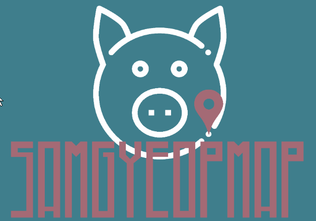

<h1>SamGyeopMap - Korean cross-map service link generator.</h1>

<h2>Background:</h2>
The Korean online Map market has 4 main players at the time of writing, Google and Apple, as well as domestic offerings from Naver (Naver Maps) and Daum (Kakao Maps). At present Google maps is unable to provide navigation in Korea, in addition its maps are generally less detailed and more likely to be out of date (see attached screen shots for anecdotal examples). To add to the complexity for users, there is increasing integration between apps from the same provider; for example Kakao Maps & Kakao Taxi.

<h2>

<h4 align="center">Address Input Page with Google Places' Autocomplete</h2>

<h4 align="center">Results Page with AQI results and links to map services</h2>

<h2>Problem:</h2>
As map user, this fragmentation of apps leaves users with pinned locations spread over several locations. Ideally I would always save locations of interest to one service, but the process of retyping out addresses and saving them, in reality, gets neglected. Finding a pinned location often means searching through all 3 apps. I may want to open a location on Google maps to save it and check reviews (I've got map of my local area with hundred of shops and services saved, I don't want to start over on another service) but then open it in Kakao to order a taxi or in Naver if I want to use its excellent route guidance.

<h2>Scope of the app:</h2>
The main purpose of this app then it to allow users to enter a location and from there easily move between map services, allowing them use the best aspects of each service. It also makes it much quicker to save a location across two or three of the services.

<h2>Method:</h2>
This app will utilise Google's Places and Maps APIs to autofill a search form and return the co-ordinates for that location respectively. I initially intended was to use Naver and Kakao APIs to reverse geolocate those coordinates and open at the requested address. Happily, especially considering the cost of keeping 4 different APIs running, I found that the services would accept coordinates as part of their URL scheme, thus removing the need for additional APIs. This reduction in workload allowed me to add air pollution data to the results (Air quality is a perenial concern in Korea).

<h2>Name:</h2>
The name of the app is a play on the name of the ever popular samgyeopsal (3 layers of flesh) pork dish - we offer 3 layers of maps. This was chosen as it's something that represents Korea but mainly because it gave me an excuse to make a pig logo.

<h2>Next steps:</h2>
The next main step will be to incorporate a back end that would allow users to log in, and keep the results pages of shared locations alive. Businesses will be able to store their location and send the link out to any customers that require it.
The other issue to overcome is to find a way to generate income to pay for the hosting and the Google API fees. Obvious candidates are ads or fees for premium services such as pages for businesses or saving multiple locations for quick sharing.  

<h2>Technology used:</h2>
HTML/CSS/Javascript & Jquery

You can try out SamGyeopMap at this address: https://williamdiffey.github.io/SamGyeopMap/ (at least until my Google credit expires!)
